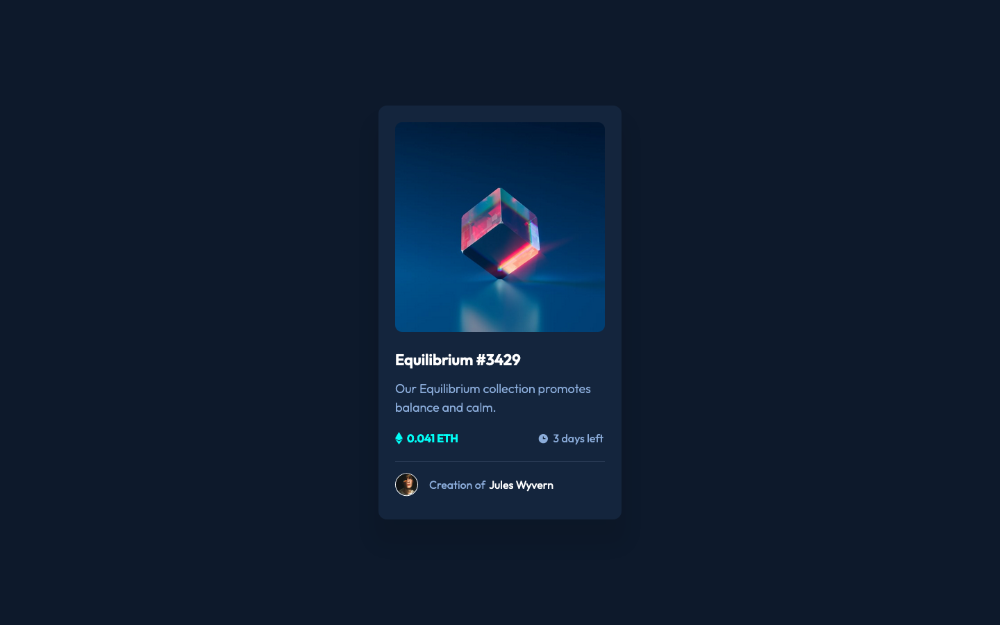
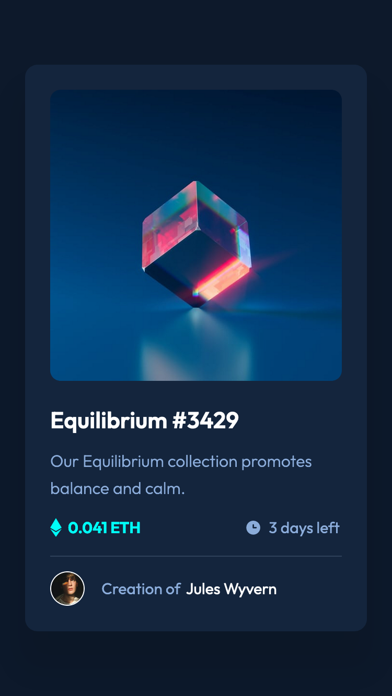

# Frontend Mentor - NFT preview card component solution

This is a solution to the [NFT preview card component challenge on Frontend Mentor](https://www.frontendmentor.io/challenges/nft-preview-card-component-SbdUL_w0U). Frontend Mentor challenges help you improve your coding skills by building realistic projects. 

## Table of contents

- [Overview](#overview)
  - [The challenge](#the-challenge)
  - [Screenshot](#screenshot)
  - [Links](#links)
- [My process](#my-process)
  - [Built with](#built-with)
  - [Continued development](#continued-development)
- [Author](#author)

## Overview

### The challenge

Users should be able to:

- View the optimal layout depending on their device's screen size
- See hover states for interactive elements

### Screenshot

### Links

- Solution URL: [frontendmentor.io](https://www.frontendmentor.io/solutions/)
- Live Site URL: [https://ericsalvi.github.io/nft-preview-card-component/](https://ericsalvi.github.io/nft-preview-card-component/)

## My process

### Built with

- Semantic HTML5 markup
- CSS Variables
- Flexbox
- CSS Grid
- Visual Studio Code
- https://autoprefixer.github.io/
- axe DevTools for accessibility

### Continued development

I am hoping to get back into using FrontendMentor.io. This was my first project back after a 9-month hiatus. For my next project I would like to stick with SASS and use the mobile-first approach. 

## Author

- Website - [Eric Salvi](https://github.com/ericsalvi)
- Frontend Mentor - [@ericsalvi](https://www.frontendmentor.io/profile/ericsalvi)